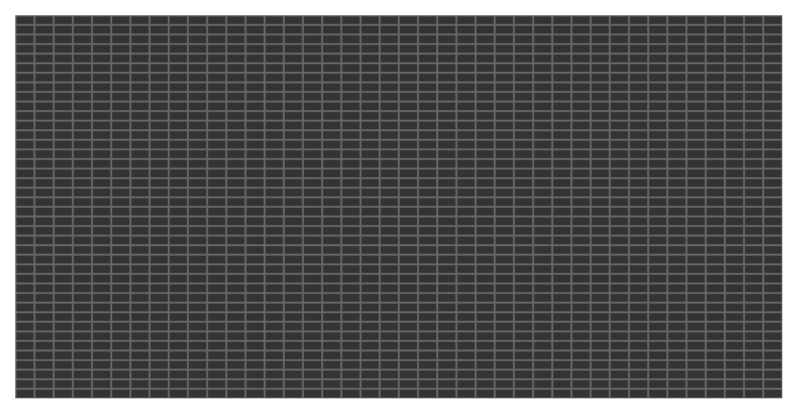

# svg-midi-grid

Render a grid suitable for midi notes as SVG.



## Usage

```js
const html = require('bel')
const Grid = require('svg-midi-grid')

const grid = new Grid()

document.body.appendChild(html`
  <svg height=200 width=400>
    ${grid.render({
      height: 201,
      width: 401,
      cellHeight: 5,
      cellWidth: 10
    })}
  </svg>  
`)
```

## Related

- __[svg-midi-note](https://github.com/juliangruber/svg-midi-note)__ &mdash; Render a Midi Note as SVG with velocitity and a selected state

## License

MIT
